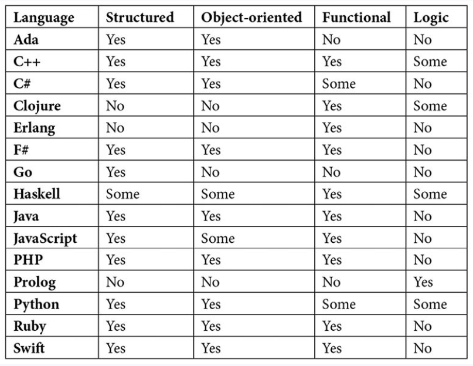

# 编程范式

结构化
面向过程
面向对象
泛型
函数式

切面？

什么叫做支持。
范式只是风格，c语言能实现以上任何范式，只是不够方便。
提供有遍历的语法。
java必须面向对象。一个方法内也是过程的。

数据类型，自定义数据格式。

In the next chapter, we will look at different ways to approach a problem and create a solution with code. This is called a paradigm. A programming language will use one of these. As we will see, some languages will use concepts from more than one paradigm.

If we look at all the programming languages, we can see patterns and similarities between them, and we can use these to classify them into different paradigms. The word paradigm means a typical example or pattern of something, and this is precisely what we are looking for in programming languages when grouping them.
The reason we want to do this classification is because the way we write a program in one of these groups will differ significantly from how we do so in languages belonging to another group.
A computer program will almost always, in one way or another, model something in the real world. We are solving real-world problems using software. The question is how best we can model and represent real-world things in code and how best we can structure the solution we have to this real-world problem.

Structured programming is what we have looked at in this book. Loops, conditionals, and functions define the flow of a program that uses this paradigm. If you have read the previous chapters of this book, then they should all be familiar to you by now.
Structured programming is a branch of a family of paradigms called imperative programming. Languages that use the concepts of imperative programming use statements to change the program's state.

this can be viewed as a command that we give to the application. In natural language, we have something that is called the imperative mood. The imperative mood is something that forms a command

Using this style of programming was what first defined imperative programming. 
 A language that supports structured programming is a language that modifies the state of the program using statements and has functions, loops, and if statements as tools to accomplish this.
We will sometimes also hear the terms procedural and modular languages. There is no need to go into the details of what the difference is between these as this is mostly academic. We can safely consider all these the same thing.

Object-oriented programming is very focused around data, so when we're deciding what a class will look like, this is often where we start. The data that makes it into our class will often dictate what kind of behavior we want it to have. This behavior often dictates the operations we need to perform on the data.

### 顺序

先后
就是运动

· 面向对象编程要求成员数据应封装在其对象中，并应防止从外部直接访问该数据。让我们看看为什么这是面向对象中的一个关键概念。

encapsulation
Encapsulation, also known as information hiding, is a concept where the object's internal implementation is hidden from everything outside the object.
· 封装可以用很多种方式来描述。美国计算机工程师詹姆斯·朗博和迈克尔·布拉哈这样描述：
一个设计目标是将类视为“黑盒子”，其外部接口是公开的，但其内部细节是隐藏的。隐藏内部信息允许更改类的实现，而不需要类的任何客户机修改代码。“
这里的关键是接口。接口是我们用来与对象进行通信的。请看图10.1中的遥控器。我们可以按的按钮是界面。我们用它们来与设备内部的逻辑进行通信。

We can hide the data by using the private keyword.

· 类方法
类方法只不过是属于某个类的函数。我们对这些函数使用不同的名称的原因是，我们可以区分属于类的函数和不属于类的函数。只要你听到有人提到一个方法，你就知道它是一个属于某个类的函数。
我们可以在类中找到两种流行的方法，即getters和setters。getter是一个返回私有成员变量值的方法，而setter是一个让我们改变其值的方法。
要使一个方法在类之外可用，我们可以使用public关键字。为此，我们可以为我们的类添加getter和setter，然后它看起来像这样:
· 这将使我们能够访问成员变量。我们现在可以创建对象，获取存储在其中的私有数据，并在需要时更改它们的值。

· 在这一点上，一个自然的问题是，为什么我们需要麻烦有这些getter和setter。为什么我们不能直接说名字和年龄是公开的，让任何人看，想怎么改就怎么改？原因是，保持数据的私有性并通过方法控制对它的访问将给我们带来控制权。
如果一个陌生人走到你面前，问你的名字，你会有一些选择。你可以回答你的真实姓名，你可以告诉他们这不关他们的事，或者你可以撒谎，告诉他们一个不同的名字。您可以控制对私有数据的访问，就像类在这些方法的帮助下可以控制对其私有数据的访问一样。

· 例如，当调用set_age方法时，我们可以检查传入的值，以确保它在有效范围内。例如，我们可以拒绝设置年龄，如果它是负数或高于任何预期的人类年龄。

· 我们可以看到，面向对象编程的强大之处在于，对象是控制其数据的自包含实体。但是面向对象编程有另一个强大的特性，可以让我们重用代码，那就是继承的概念。

· 在这里，员工继承人将继承Person的一切。我们需要在Employee类中定义的唯一事情是使这个类具有唯一性的东西。正如我们通常用包含三个部分的矩形来表示类一样，继承是用一个空心的、像箭头一样的符号来可视化的，如前面的图像所示。

确切地说，面向对象编程的实现方式因语言的不同而不同。支持面向对象的语言有时也会在如何使用面向对象的规则上略有不同。像往常一样，我们需要学习我们正在使用的语言是如何定义面向对象原则的。
下面是一些支持面向对象的流行语言的列表，这些语言有的完全支持面向对象，有的只是作为一种选择
· 面向对象是主要的范式之一。有很多喜欢它的粉丝，他们认为这是一种结构化代码的好方法。我们要研究的下一个范例已经存在了很长时间，但在最近几年才开始流行起来：函数式编程。它现在被许多程序员认为是比较有趣的范例之一。

· 函数式编程是一种已经流行起来的范例。
它不是新的，我们可以追溯它的根源到Lambda演算，这是在20世纪30年代介绍。在20世纪50年代，程序设计语言Lisp开发并实现了这种范例。
正如我们将看到的，这个范例对于程序的结构和实现有一个非常不同的方法。
您将需要重新思考您看待编程和代码结构的方式，以便能够理解这种范例的优点。
我们将从函数式编程的定义开始。
这个定义本身就很难理解，所以我们还需要看一下它的某些部分来理解这是怎么一回事。
一个定义如下：
函数式编程是一种构造计算机程序的方法，它将计算视为对数学函数的求值，避免改变程序的状态和使用可变数据。

我们先来解读一下这个定义。
Functional programming is a way of structuring a computer program that treats computation as the evaluation of mathematical functions and avoids changing the state of the program and the use of mutable data.

将计算视为数学函数的评估部分可能听起来很可怕。如果我们仔细看这一点，我们会看到，这是相当直截了当的。
让我们看两个数学函数，看看我们如何使用和理解它们，以便理解函数式编程的定义在说什么。

· 当用函数式编程的术语来谈论数学函数时，这是一个至关重要的事实：
具有相同输入的函数将总是返回相同的答案。
在函数式编程中，这被称为纯函数。pure function

· 用相同的参数（在我们的例子中没有）调用随机函数将不会得到相同的答案。这不是一个纯粹的函数。

这就是前面定义中对数学函数求值的意义。

· 接下来是定义的第二部分，避免改变程序的状态和可变数据的使用。
改变状态是我们在讨论结构化编程时认识到的事情。
在这里，我们说过结构化编程使用语句来改变程序的状态。
看来函数式编程是在谈论与结构化编程完全相反的东西。
我们说过，程序所处的状态是由存储在所有变量中的数据在任何给定时间的组合来定义的。
更改一个变量的值将改变程序的状态。
如果一个程序避免改变其状态，这意味着什么？我们不能改变任何变量吗？对此的回答是肯定的，这就是定义的最后一部分：它也避免使用可变数据。可变数据意味着什么？我们会在下一节看到这是怎么回事。

Mutable and immutable data
Mutable means liable to change, while immutable means unable to be changed. The term mutable data means that we have data that we can change.
· 可变数据和不可变数据
可变的意思是容易改变的，而不变的意思是不能改变的。术语可变数据意味着我们拥有可以更改的数据。

· 在这里，我们首先将值10赋给x变量，然后将值20赋给y变量。在最后一行，我们改变x的值，使其与y相同，也就是20我们可以说x是可变的，因为我们可以改变它。但这能证明x是可变的吗？在某些语言中，它是正确的，但在另一些语言中，这是完全不正确的，即使在x中的最终值将永远是20。如果我们不能改变x的值，它怎么可能从10变成20呢？这听起来不太可能。
答案在于语言处理其变量的方式。如果我们把一个变量想象成一个盒子，在里面我们可以存储一个值，并且，在任何时候，用另一个值来替换它，它是可变的，但是如果我们把一个变量想象成，在计算机内存中指出一个值的东西，事情就会有些不同。
让我们来做一个小小的思维实验。我们可以从x和y这两个变量开始，再一次给它们赋值10和20，就像我们之前做的那样：

· 我们可以看到，值10和20并没有存储在变量内部。相反，变量指出这些值在内存中的位置。

· 这就是不变性的原理。变量并没有改变。而是在内存中的另一个位置创建一个新值。因为我们不能改变任何变量，所以我们也不能改变程序的状态。
但是，为什么我们的变量是不可变的，我们不能改变程序的状态是很重要的呢？答案叫做副作用。

Avoiding side effects
A side effect in computer programming is when an expression modifies some values in the variables that are outside its local environment. 

全局变量x。
· 如果我们使用的语言将x定义为可变的，那么我们就可以改变它。但是在一个x是不可变的语言中，就不会有变化。相反，我们会得到一个新的x变量，它只存在于函数内部。
看样子和作用域也有关系

· 这是因为函数返回的结果依赖于之前对函数的调用。
如果我们有一个没有副作用的程序，那么当程序运行时会发生什么将是非常可预测的。如果我们想想前面的小程序，我们看到，这将是几乎不可能的，我们预测什么样的调用函数会导致什么样的结果，因为结果将取决于以前的调用，以及什么样的数据，我们提供的参数在这些调用。
函数式编程的下一个原则叫做声明式编程。来看看是怎么一回事

· 为了理解什么是声明式编程，我们可以把它和我们所知道的东西进行比较，那就是命令式编程。在命令式编程中，我们专注于描述如何完成某件事。另一方面，在声明式编程中，关注的焦点是我们想要达到的目标。
了理解这一点，我们将看一些现实世界中的例子。如果你去一家餐厅，你可以是一个祈使式或陈述式的客人。

· 在计算机科学中，声明性的一个很好的例子是SQL。是结构化查询语言的缩写，用于从数据库中存储和检索数据。

这是声明性的，因为我们说我们想要什么-客户的名字和姓氏-但我们没有说如何检索数据。在底层数据库系统中的某个位置，某些部分必须知道这将如何完成，但如果我们使用的是SQL，则不需要了解这是如何完成的。

Python is a programming language where we can write both imperative and declarative programs. Let's look at two programs that perform the same thing, one in an imperative way and one in a declarative way.
Python是一种编程语言，我们可以在其中编写命令式程序和声明性程序。让我们看一下执行相同任务的两个程序，一个以命令式方式执行，另一个以声明性方式执行。

· 这个程序的第二个版本是用声明式风格写的，如下所示：
字符串=【06年，68年，00年，30年】
Numbers=【int（value）表示字符串中的值，如果是int（value）！= 0]
打印（数字）
这个程序和前一个程序做的事情是一样的，但是编写的方式有很大的不同。它使用一种叫做列表理解的东西。它是numbers=之后的部分。如果仔细观察，可以在这个表达式的中间看到一个for循环。它看起来就像另一个例子中的for循环。在这个循环之后，我们可以看到一个if，它看起来就像第一个程序中的if语句。在理解中这个位置的if充当过滤器。如果该值被计算为true，则当前值将被传递到该表达式的前面。这里，我们将值转换为整数。转换后的值将是一个名为numbers的列表的一部分。

This is declarative because we don't say how this value will get into the new list, we just say what will go into the list.

The final principle used by functional programming that we will cover is called first-class functions.
· 我们将介绍的函数式编程使用的最后一个原则称为一级函数。

Functional programming uses the principle of first-class functions. A function is said to be first-class if it is treated as a first-class citizen of the programming language in question. A first-class citizen is something that we can modify, pass as an argument to a function, return from a function, and so on.

Being able to work with functions like this has several benefits. Let's look at an example. Earlier in this chapter, we talked about object-oriented programming, and we defined a class called Person. We saw that we could create several objects from this class, each one representing one person.
Later in this chapter, we will see that

programming languages can use more than one paradigm, and if we use one that lets us define classes and use functions as first-class citizens, we can do something very useful.

· 它所知道的是如何对列表进行排序，但它需要一个函数的帮助，该函数可以从Person类接收两个对象，如果第一个对象大于第二个对象，则返回true；如果第一个对象小于第二个对象，则返回false。我们需要写这个函数，并在其中定义一个对象比另一个对象大的原因。

First-class functions are a compelling feature that let us write functions that are more general-purpose as we can pass another function that will do parts of its job, just as the sort function works.
Functional programming has several concepts that are both powerful and let us write higher quality code. That is the reason why functional programming is constantly gaining popularity and why many non-functional programming languages are borrowing functional concepts.

· 函数式编程不仅是一种非常有趣的范式，而且它还影响着许多成熟的语言，使它们能够融入函数式的概念。下一个范例的应用并不像我们到目前为止所看到的范例那样广泛，但它有一些有趣的概念。

· 这种范式是基于形式逻辑的。用实现这种范例的语言编写的程序由一组逻辑形式的语句构成，这些语句将表达关于特定问题域的事实和规则。
这听起来可能既复杂又奇怪，但是正如我们将看到的，这个范例的基本概念相当简单。考虑下面的关系图：
· 它们的顺序可能看起来很奇怪，但大多数逻辑语言希望我们将所有同类谓词组合在一起，因此，在本例中，我们首先定义所有的母亲，然后定义所有的父亲。
在第一行，我们可以看到安娜是丽莎的母亲，而在第四行，我们可以看到鲍勃是丽莎的父亲。这些名称之所以称为atoms，是因为它们表示单个值，并且atoms只需要用小写字母定义。

The following is a list of some languages that support logic programming:
ALF
Curry
Fril
Janus
Prolog
The way we structure the code in logic programming is very different from all other paradigms, making it an interesting outsider.
We have now looked at the leading players in the paradigm field. But before we leave these paradigms behind, let's just mention a few more to get a more complete picture.

· 在函数级编程中，我们根本没有变量。相反，程序是由初等函数构建的，结合了函数到函数的操作，有时被称为函数或函数形式。
实现这种范式的语言是围绕以下层次结构构建的:
原子是函数操作的数据。它们只会出现在程序的输入或输出中，在实际的程序中永远找不到。
函数将原子转换为其他原子。程序设计语言将定义一组函数，程序员可以使用函数形式创建新的函数。程序本身也是一个函数。
函数形式用于将函数转换为其他函数。程序员可以使用它们来创建新的表单。

· 在数组编程中，操作将一次对一整组值执行。这些解决方案通常用于科学和工程应用。
操作被推广为既适用于标量也适用于数组。在本书中，我们遇到过以变量形式表示的标量，这些标量一次只能保存一个单个值。我们还研究了数组。

· 如果a和b是标量，如果它们是数组，则a+b运算的作用将不同。如果它们是标量，结果将是两个值相加的和。如果它们是数组，则结果将是存储在这两个数组中的所有值的和。
数组编程可以简化编程，但以效率为代价。这意味着，当我们编写代码时，使用这些类型的语言会更容易，但运行它们可能会比使用另一种范式的语言编写的程序花费更长的时间。

Quantum programming
· 这是未来的典范。为了能够使用这种模式，我们将需要量子计算机。量子计算机使用量子物理学中定义的粒子的量子力学特性。这些粒子具有叠加性，这意味着在我们观察它们之前，它们将处于任何可能的位置。量子计算机将通过定义一种称为量子位元的东西来使用它。普通计算机的位可以是0也可以是1。一个量子位将两者兼而有之，利用这个特性，一台量子计算机将能够在一小部分时间内计算出任何给定输入的所有可能结果，从而与我们今天使用的计算机进行相同的计算。
· 量子编程本身并不是一种范式，但是为了能够为量子计算机编写程序，我们将需要能够支持我们目前使用的语言之外的其他类型的操作的语言。
· 尽管我们刚刚看到第一台量子计算机慢慢成形，但我们已经定义了几种可以用于它们的语言。它们是建立在已经存在的范例之上的，比如命令式和函数式编程。当我们有了功能齐全且易于使用的量子计算机，我们将看到新语言的爆发，这些语言将利用这些计算机的能力。

· 大多数编程语言不会只坚持一种范式，而是使用几种。这就是为什么它们被称为多范式语言。我们可以把一些最流行的语言做一个表格，看看它们支持什么样的范式：

· 范例对程序设计语言的影响程度总是有争议的。在这里，我已经看了我们在本章中看到的主要范例，以及语言的文档是如何描述它们自己的。
标记为Some的语言已经实现了这种范式的一些概念。对于一种范式，一种在列中给出“是”的语言可能并没有将这种范式作为它的主要范式，但是已经实现了它的许多特性。
